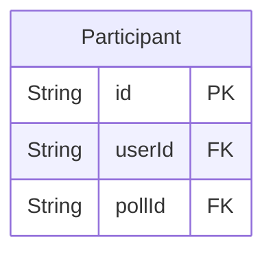
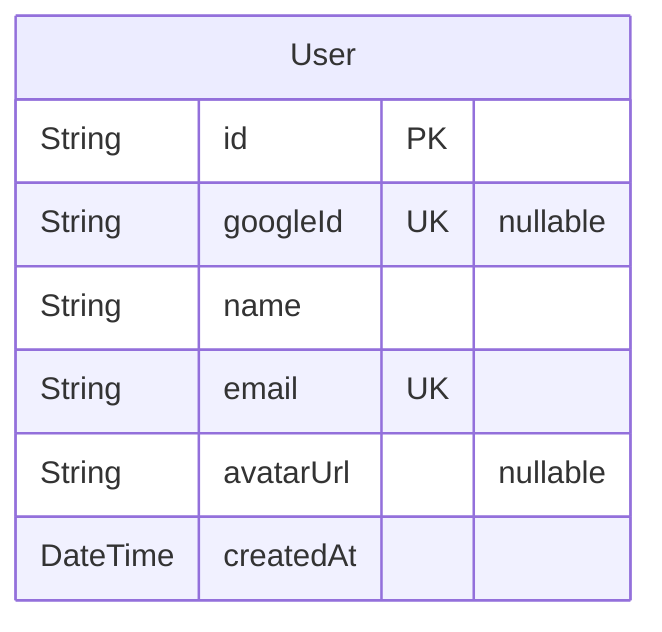

# NLW Copa
> Generated by [`prisma-markdown`](https://github.com/samchon/prisma-markdown)

- [Polls](#polls)
- [Participants](#participants)
- [Users](#users)
- [Games](#games)
- [Guesses](#guesses)

## Polls

### `Poll`
Bolão.

Todo bolão realizado pelos usuários participantes.

**Properties**
  - `id`: Chave primária.
  - `ownerId`: ID do dono do bolão [users.id](#users)
  - `title`: Título do bolão
  - `code`: Código para o bolão
  - `createdAt`: Data de criação

## Participants

### `Participant`
Participantes.

Armazenar os participantes dos bolões.

**Properties**
  - `id`: Chave primária.
  - `userId`: ID do usuário participante [users.id](#users)
  - `pollId`: ID do bolão [polls.id](#polls)

## Users

### `User`
Usuários.

Armazenar os usuários.

**Properties**
  - `id`: Chave primária.
  - `googleId`: ID do usuáio no Google 
  - `name`: Nome do usuário
  - `email`: E-mail do usuário
  - `avatarUrl`: URL do avatar do usuário
  - `createdAt`: Data de criação

## Games

### `Game`
Jogos.

Armazenar os jogos da copa.

**Properties**
  - `id`: Chave primária.
  - `date`: Data do jogo
  - `firstTeamCountryCode`: Código do time mandante
  - `secondTeamCountryCode`: Código do time visitante

## Guesses

### `Guess`
Palpites.

Armazenar de palpites.

**Properties**
  - `id`: Chave primária.
  - `gameId`: ID do jogo [games.id](#games)
  - `participantId`: ID do usuário participante [participants.id](#participants)
  - `firstTeamPoints`: Gols marcados pelo time mandante
  - `secondTeamPoints`: Gols marcados pelo time visitante
  - `createdAt`: Data do jogo